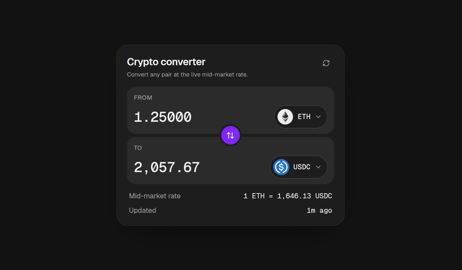

# Problem 2 — Facet

A crypto converter built from a supplied design ([brochure](./public/brand/brochure.png)),
priced from [`interview.switcheo.com/prices.json`](https://interview.switcheo.com/prices.json)
with the [Switcheo token icons](https://github.com/Switcheo/token-icons). Type into either
field and the other follows at the live rate.

**Live:** <https://facet-converter.vercel.app>



## Commands

Run from the repository root.

```bash
pnpm install                        # once, for the whole workspace
pnpm p2                             # dev server on http://localhost:5172
pnpm test --project problem-2       # this package's tests
pnpm --filter problem-2 typecheck   # tsc
pnpm --filter problem-2 build       # production build into src/problem2/dist
pnpm --filter problem-2 preview     # serve that build
```

## Architecture

```text
prices.json → lib/http (axios) → lib/prices (zod) → usePrices (TanStack Query)
            → SwapCard → useSwapForm (react-hook-form) → AmountField ×2
```

| Layer          | Files                                                                             | Role                                              |
| -------------- | --------------------------------------------------------------------------------- | ------------------------------------------------- |
| Screen         | `App.tsx`, `queryClient.ts`                                                       | Page shell and the query cache.                   |
| Container      | `components/SwapCard.tsx`                                                         | Owns the feed and the form; wires the two halves. |
| Presentational | `components/AmountField`, `TokenSelect`, `TokenIcon`, `SwapButton`, `RateSummary` | Render and emit events; no domain state.          |
| State          | `hooks/usePrices`, `useSwapForm`, `useSwapAnimation`                              | The feed query, the form, the swap animation.     |
| Domain         | `lib/prices`, `format`, `schema`, `tokens`, `http`                                | Plain TypeScript and zod schemas; no React.       |
| UI primitives  | `components/ui/*`                                                                 | shadcn/ui.                                        |

- **`lib/` knows nothing about React, and components know nothing about the feed.** Rate
  maths, precision and validation are plain functions, tested without a DOM.
- **One amount is stored.** The form keeps the amount as typed and which side it was
  typed into. The other side is derived from the live rate on every render, so the two
  cannot drift apart when prices refresh.
- **The form is the swap request.** react-hook-form holds `fromCode`, `toCode`, `source`
  and `amount`, and validates them against `swapRequestSchema` through `zodResolver`.
  Errors appear as you type, under the field that holds the amount.
- **The feed is one query.** React Query cancels superseded requests, retries once after
  300 ms, treats prices as fresh for a minute, and keeps the last good prices when a
  refresh fails. Refresh adds a `t=<now>` parameter so the browser cannot answer from its
  cache.

## Libraries

| Library                                | Used for                                                                   |
| -------------------------------------- | -------------------------------------------------------------------------- |
| React 19, Vite 8                       | The UI, its dev server and build.                                          |
| Tailwind CSS v4, shadcn/ui             | Styling from CSS-variable tokens; Button, Popover (Radix), Command (cmdk). |
| lucide-react                           | Icons.                                                                     |
| TanStack Query 5                       | Loading, caching and retrying the price feed.                              |
| axios                                  | The request itself: a 10 s timeout, and errors that carry the status.      |
| zod 4                                  | Parsing feed rows one at a time, and the swap request's rules.             |
| react-hook-form 7, @hookform/resolvers | Form state and when to validate, through the zod schema.                   |
| use-debounce                           | Keeping the asset list 150 ms behind the search field.                     |
| @fontsource-variable/geist, geist-mono | Self-hosted Geist fonts.                                                   |

Testing, linting and formatting use the workspace's shared tooling, listed in the
[root readme](../../readme.md).
